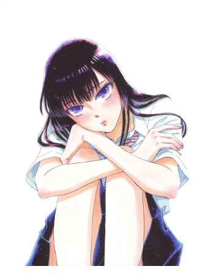

  
   
  

  <h3><strong>その日私たちが見た花</strong></h3>
  

    <strong>T E C N O L O G I A</strong>
    &nbsp; • &nbsp;
    <strong>C R I A T I V I D A D E</strong>
    &nbsp; • &nbsp;
    <strong>P S I C O L O G I A</strong>
  

 

  

      

  

    <h3>Oi ✦</h3>
    

      Gosto de criar coisas misturando criatividade e tecnologia. Meu primeiro contato
      com programação foi em 2013, usando o Small Basic. 
      Em algum momento da minha infância eu passei a amar tecnologia. Principalmente inteligência artificial, e a maior parte disso foi graças à Cortana, de Halo.
    

      No geral gosto de aprender e criar desde de inteligência
      artificial, interfaces, bots, jogos, design e outras ideias que aparecem pelo caminho.
    

    

      Também estudo psicologia e tento entender como pessoas e máquinas aprendem, inclusive meu foco é na área da neurociência, pretendo aplicar todas as ideis e desenvolvimento que eu tiver na minha IA.
    

    

      
      
      
    

  

 

 

<h1 align="left"><strong>O Q U E &nbsp; E U &nbsp; C R I O</strong></h1>

  

  

    Gosto de transformar ideias em coisas que tenham personalidade, misturando
    tecnologia, design e comportamento humano.
  

  <h3>✦ UMI</h3>
  

    Minha inteligência artificial pessoal, criada para aprender continuamente,
    construir memórias e me acompanhar por meio de uma interface própria.
  

  <h3>✦ Moe UwU</h3>
  

    Um bot para Discord feito com carinho, personalidade e vontade de experimentar.
    <a href="https://moebot.uwu.ai/"><strong>Conhecer a Moe</strong></a>.
  

  <h3>✦ Latão do LixU</h3>
  

    Um site em React para reunir aniversários, perfis e histórias do grupo,
    com uma estética inspirada em Frutiger Aero e webcore.
  

  <h3>✦ LixU Archavier</h3>
  

    Um acervo visual criado para explorar e organizar animes, mangás e visual novels.
  

  

    
  

 

 

<h1 align="left"><strong>S T A T U S</strong></h1>

  

  

 

   

  

    

  

